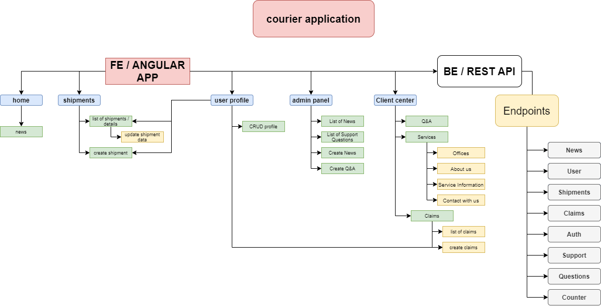

# <span style="background-color: gray; padding: 8px; border-radius: 10px;font-weight:bold">Courier-Application</span>
This repository is part of full - stack application.

- [Front-end application](https://github.com/Ivnchev/courier-application)
- [Back-end Rest API](https://github.com/Ivnchev/courier-REST-API)

# 1. Technology stack

## 1.1 Front-end

* *Angular*
* *Angular Material*
* *HTML5 & CSS3*

## 1.2 Back-end

* *MongoDB*
* *Express*    
* *Node.js*
* *Mongoose*

# 2. Project chart



# 3. Run the application

## 3.1 Development
Use below steps to setup locally:
```
git clone "https://github.com/Ivnchev/courier-application.git"
```
```
cd courier-application
```
### 3.1.1 Front End
- Run SPA application:
```
ng serve
```
This will run the application on [http://localhost:4200 ](http://localhost:4200 )

### 3.1.2 Back End
- Run REST API:
```
npm start
```
This will run the rest API on [http://localhost:3000 ](http://localhost:3000 )

## 3.2 Production

### You can see example of the application here : [https://courier-workshop.herokuapp.com/](https://courier-workshop.herokuapp.com/)

### 3.2.1 Front End
- Build application
```
ng build -c production
```
This will store the project in ```dist/``` directory

### 3.2.2 Back End

- Needs to use some module bundler like Webpack. To run the project use :
```
npm start
```
The API is deleveped to run at any environment port. ```By default the port will be: 80``` 
